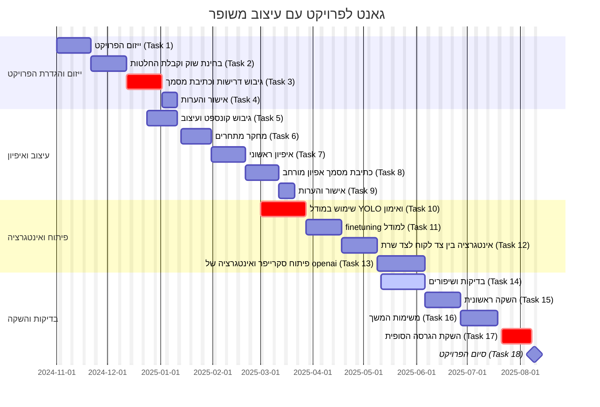

```mermaid
gantt
    dateFormat  YYYY-MM-DD
    title       גאנט לפרויקט עם עיצוב משופר
    excludes    weekends

    section ייזום והגדרת הפרויקט
    ייזום הפרויקט (Task 1)           :a1, 2024-11-01, 14d
    בחינת שוק וקבלת החלטות (Task 2)  :a2, after a1, 15d
    גיבוש דרישות וכתיבת מסמך (Task 3) :crit, a3, after a2, 15d
    אישור והערות (Task 4)            :a4, after a3, 7d

    section עיצוב ואיפיון
    גיבוש קונספט ועיצוב (Task 5)     :b1, 2024-12-24, 14d
    מחקר מתחרים (Task 6)             :b2, after b1, 14d
    איפיון ראשוני (Task 7)           :b3, after b2, 14d
    כתיבת מסמך אפיון מורחב (Task 8)  :b4, after b3, 14d
    אישור והערות (Task 9)            :b5, after b4, 7d

    section פיתוח ואינטגרציה
    שימוש במודל YOLO ואימון  (Task 10)        :crit, c1, 2025-03-01, 20d
    finetuning למודל (Task 11)   :c2, after c1, 15d
    אינטגרציה בין צד לקוח לצד שרת (Task 12) :c3, after c2, 15d
    פיתוח סקרייפר ואינטגרציה של openai (Task 13)  :c4, after c3, 20d

    section בדיקות והשקה
    בדיקות ושיפורים (Task 14)       :active, d1, 2025-05-11, 20d
    השקה ראשונית (Task 15)          :d2, after d1, 15d
    משימות המשך (Task 16)           :d3, after d2, 16d
    השקת הגרסה הסופית (Task 17)     :crit, d4, after d3, 14d
    סיום הפרויקט (Task 18)          :milestone, d5, after d4, 1d
```
